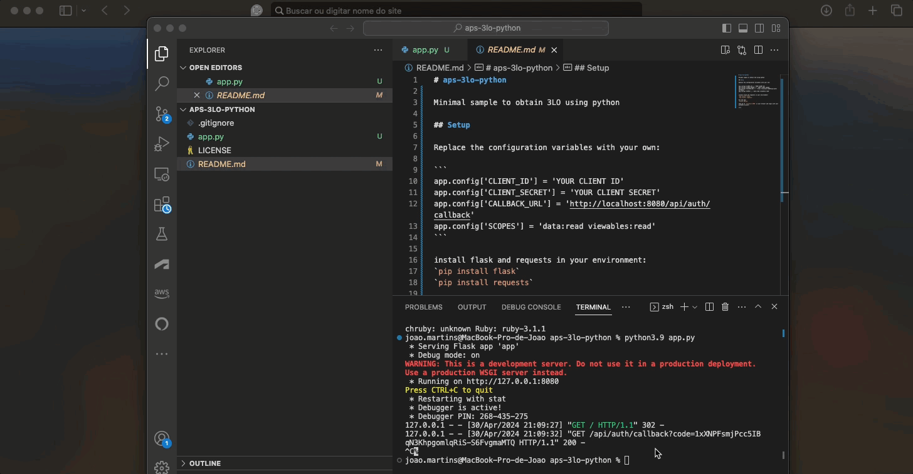

# aps-3lo-python

Minimal sample to obtain 3LO using python

## Setup

Replace the configuration variables in the .env file with your own:

```
CLIENT_ID=''
CLIENT_SECRET=''
CALLBACK_URL='http://localhost:8080/api/auth/callback'
SCOPES='data:read viewables:read'
```

install flask and requests in your environment:

`pip install flask`

`pip install requests`

`pip install python-dotenv`

Run the app:

`python app.py`

Then go to `localhost:8080` in your browser and login with your Autodesk account:



## License

This sample is licensed under the terms of the [MIT License](http://opensource.org/licenses/MIT). Please see the [LICENSE](LICENSE) file for full details.

## Written by

Joao Martins [in/jpornelas](https://linkedin.com/in/jpornelas), [Developer Advocate](http://aps.autodesk.com)
